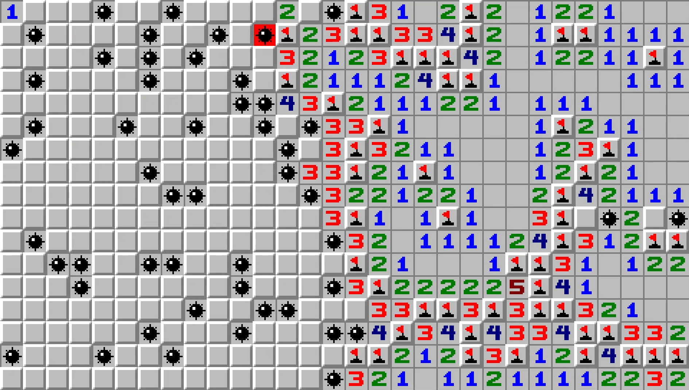

# Minesweeper


## Minesweeper solver




## Setup

| Level        | Description                           |
| :------------| :-------------------------------------|
| Beginner     | 10x10 board with 10 mines (10%)       |
| Intermediate | 16x16 board with 40 mines (15.625%)   |
| Expert       | 30x16 board with 99 mines (20.625%)   |
| Custom       | any configuration                     |


It is impossible to lose on the first move, though it is not guaranteed that more than one cell is uncovered.


## Algorithm


### Description

The solution is implemented as a combination of Single Point Strategy and Constraint Satisfaction Problem solution.


All calculations are made on the edge of the revealed field only. Edge is a set of all uncovered cells, that have at least one covered, unflagged neighbor. Setup is said to be trivial if every covered, unflagged neighbor of any cell is either a mine or mine-free.


On every move, the algorithm first checks if the setup is trivial. If so, all mines are flagged and all mine-free cells are uncovered, the setup is checked again.  
If the setup is non-trivial all constraints are simplified if possible and divided into independent groups. If setup remains non-trivial, all possible solutions are generated through brute force. Using chronological backtracking when any inconsistent combination is generated the most recently assigned variable is reassigned and the search continues.  
The probability of a cell being a mine, in this case, is the number of appearances in all combinations divided by the number of all possible solutions. The lowest obtained probability is compared with the mine probability of a random cell which is the number of mines left divided by the number of covered cells left. If the probability of a random cell being a mine is lower, then the solver uncovers the corner, edge, or inner cell in this order as it gives the best chances for retrieving more information.

For more details please refer to [this paper](https://dash.harvard.edu/bitstream/handle/1/14398552/BECERRA-SENIORTHESIS-2015.pdf)


### Expert level


## Performance

| Level        | Games played | Wins    | Percent    |
| :------------| :------------| :-------| :----------|
| Beginner     | 500 000      | 474 374 |  94.87 %   |
| Intermediate | 50 000       | 37 318  |  74.64 %   |
| Expert       | 5 000        | 1 539   |  30.78 %   |


## Usage

There are three standard levels:

```python
solver = Solver(level='beginner')
solver = Solver(level='intermediate')
solver = Solver(level='expert')

```

It is also possible to make a custom level:

```python
solver = Solver(level='custom', size=(480, 270), mine_probability=0.2)
```

